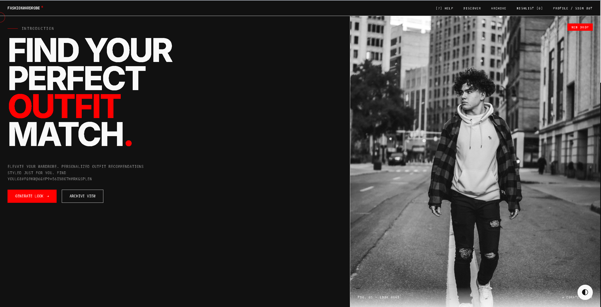
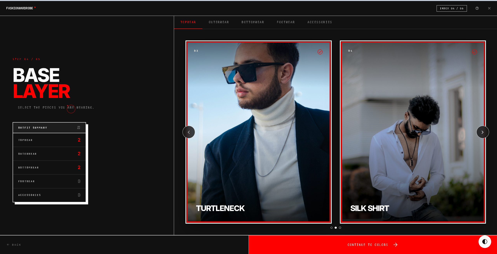
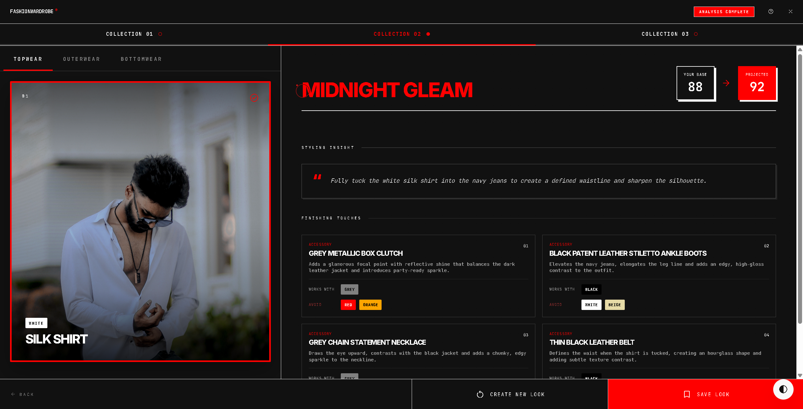
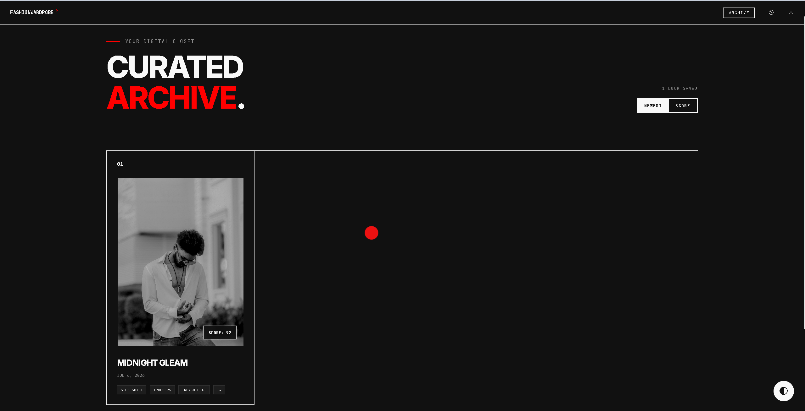
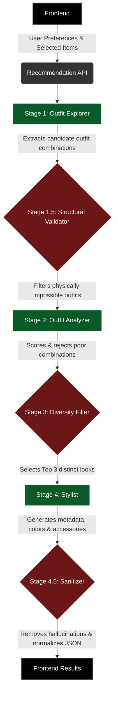

# 👗 FashionWardrobe

**FashionWardrobe** is an AI-powered fashion recommendation web app that analyzes your outfit selections and suggests curated accessories using a multi-stage AI styling pipeline — all in real time.

---

## ✨ Features

- 🎯 **Personalized Style Quiz** — Select your gender, occasion, style personality, and budget through an intuitive multi-step flow
- 👔 **Outfit Builder** — Browse and pick items across categories: topwear, bottomwear, outerwear, footwear & accessories
- 🎨 **Color & Pattern Picker** — Assign colors and patterns to each outfit item using an interactive color picker
- 🤖 **4-Stage AI Styling Pipeline** — A sophisticated recommendation engine that explores, evaluates, filters, and styles complete outfits
- 📊 **Match Score** — Get a cohesive projected score for your AI-curated outfits
- 💾 **Archive** — Save your favorite AI-generated recommendations (stored locally on this device)
- ❤️ **Wishlist** — Bookmark accessory items you want to buy later (stored locally on this device)
- 🔐 **Sign In** — Optionally sign in with Google or email to save your name/preferences locally on this device

> **Note on authentication:** Sign-in is client-side only. Your name and email are stored in `localStorage` on your device. There is no server-side account system or cloud persistence.

---

## 📸 Screenshots

*(Replace the placeholders below with actual screenshots of your application)*

### Landing Page


### Outfit Selection


### Recommendation Results


### Saved Archive


---

## 🚀 Demo

*(Link to your live demo, video walkthrough, or interactive presentation here)*

**[View Live Demo](#)** | **[Watch Walkthrough Video](#)**

---

## 🛠️ Tech Stack

| Layer | Technology |
|-------|------------|
| Frontend | Vanilla HTML, JavaScript, Tailwind CSS (CDN) |
| Fonts | Google Fonts (Montserrat, Inter, Playfair Display) |
| Icons | Google Material Symbols |
| Color Picker | [Pickr](https://simonwep.github.io/pickr/) |
| AI Images | [Pollinations AI](https://pollinations.ai/) |
| Backend | Node.js + Express |
| Primary AI Engine | Google Gemini 2.5 Flash (`@google/generative-ai`) |
| Fallback AI Engines | NVIDIA NIM API, OpenRouter (optional) |
| Auth | Google Identity Services (GSI) — client-side only |

---

## 🧠 AI Pipeline Architecture

FashionWardrobe uses a deterministic, multi-stage LLM pipeline to ensure high-quality recommendations. Instead of relying on a single prompt, the engine breaks the problem into discrete logic steps.



### Pipeline Stages Explained

1. **Stage 1 (Explorer)**: Uses a fast, creative LLM (e.g. Qwen) to generate many potential outfit candidate arrays based purely on structural IDs.
2. **Stage 2 (Judge)**: Uses a highly logical LLM (e.g. Gemini 2.5 Flash) to independently grade and potentially reject each candidate outfit based on style rules.
3. **Stage 3 (Filter)**: A deterministic JavaScript function that deduplicates outfits, removes subsets, and selects the top 3 highest-scoring variations.
4. **Stage 4 (Stylist)**: Uses an advanced LLM (e.g. Llama 3.1 70B) to generate the final editorial metadata, color harmonization logic, and accessory suggestions for the top outfits.

---

## 📁 Project Structure

```
FashionWardrobe/
├── index.html              # Main app shell (SPA)
├── css/
│   └── app.css             # App-wide styles
├── js/
│   ├── app.js              # App entry point & initialization
│   ├── router.js           # Client-side SPA router
│   ├── store.js            # Global state management
│   ├── data/
│   │   └── mock-data.js    # Product catalog (clothing items)
│   ├── engine/
│   │   └── recommend.js    # AI recommendation engine (calls backend)
│   └── pages/
│       ├── landing.js      # Landing / hero page
│       ├── auth.js         # Sign-in page (local storage only)
│       ├── gender.js       # Step 1: Gender selection
│       ├── occasion.js     # Step 2: Occasion selection
│       ├── style.js        # Step 3: Style personality selection
│       ├── outfit.js       # Step 4: Outfit item selection
│       ├── color.js        # Step 5: Color picker
│       ├── results_new.js  # Results page with AI recommendations
│       ├── archive.js      # Saved looks page (localStorage)
│       └── wishlist.js     # Wishlist page (localStorage)
└── server/
    ├── server.js           # Express backend
    ├── pipeline/           # 4-stage AI pipeline orchestration
    ├── stages/             # Stage 1–4 implementations
    ├── prompts/            # LLM prompt builders
    ├── llm/                # LLM provider adapters (Gemini, NVIDIA, OpenRouter)
    ├── utils/              # Helpers: colors, metrics, logger, JSON parser
    ├── test/               # Deterministic pipeline tests (npm test)
    ├── scripts/            # Dev/migration utilities (not runtime code)
    ├── package.json        # Backend dependencies
    └── .env.example        # 📋 Copy this to .env and fill in your keys
```

---

## 🚀 Getting Started

### Prerequisites

- [Node.js](https://nodejs.org/) (v18 or higher)
- A [Google Gemini API Key](https://aistudio.google.com/app/apikey)

### 1. Clone the repository

```bash
git clone https://github.com/darkcrownsumeet/FashionWardrobe.git
cd FashionWardrobe
```

### 2. Set up the backend

```bash
cd server
npm install
```

### 3. Configure environment variables

Copy `.env.example` to `.env` inside the `server/` directory and fill in your keys:

```bash
cp .env.example .env
```

> ⚠️ **Never commit your `.env` file.** It is already listed in `.gitignore`.

### 4. Start the backend server

```bash
node server.js
```

The API will be available at `http://localhost:4000`.

You can verify the server is running:
```bash
curl http://localhost:4000/health
# → {"status":"ok","timestamp":"..."}
```

### 5. Open the frontend

Simply open `index.html` in your browser, or serve it with any static file server:

```bash
# Using Python
python -m http.server 8080

# Using VS Code Live Server extension
# Right-click index.html → "Open with Live Server"
```

---

## 🌐 API Endpoints

### `GET /health`

Returns server status. Useful for readiness checks.

```json
{ "status": "ok", "timestamp": "2026-07-03T15:00:00.000Z" }
```

### `POST /api/recommend`
*(Utilizes Server-Sent Events / SSE)*

Analyzes the user's wardrobe and returns styled outfit recommendations by streaming real-time status updates through the 4-stage AI pipeline.

**Request Body:**
```json
{
  "prefs": {
    "gender": "male",
    "occasions": ["casual"],
    "stylePersonality": ["streetwear"],
    "budget": "Mid-range",
    "itemColors": { "item-id": { "primary": "Navy" } }
  },
  "selectedItems": [
    { "id": "item-id", "name": "White Oversized Tee", "category": "topwear" }
  ]
}
```

**SSE Event Streams:**
- `status`: Streaming pipeline stages (e.g., "Exploring wardrobe...", "Styling final selections...")
- `result`: The final JSON object containing outfit collections.
- `error`: Emitted on fatal failure or validation error.

---

## 🔒 Environment Variables

| Variable | Status | Description |
| :--- | :--- | :--- |
| `GEMINI_API_KEY` | Required | API key for Gemini (Stage 2 Judge model) |
| `NVIDIA_API_KEY_QWEN` | Required | NVIDIA NIM key for Qwen (Stage 1 Outfit Generation) |
| `OPENROUTER_API_KEY` | Required | OpenRouter key for NVIDIA Nemotron-3 Super (Stage 4 Styling) |
| `FRONTEND_URL` | Required | Allowed CORS origin (e.g. `https://my-app.vercel.app`) |
| `PORT` | Optional | Server port (Defaults to 4000) |
| `DEBUG_PIPELINE` | Optional | Set `true` to enable verbose LLM logging (Dev only) |
| `NVIDIA_API_KEY_STAGE2` | Optional | Fallback key if Stage 2 Gemini fails |
| `NVIDIA_API_KEY_LLAMA` | Optional | Fallback key if Stage 4 OpenRouter fails |
| `NVIDIA_API_KEY_MINIMAX` | Optional | Fallback key if Stage 1 Qwen fails |
| `NVIDIA_API_KEY_DEEPSEEK` | Optional | Additional optional fallback model |

> **Multi-Provider Architecture:** The pipeline requires all three core API keys (`GEMINI_API_KEY`, `NVIDIA_API_KEY_QWEN`, `OPENROUTER_API_KEY`) to run its primary models. The other keys are only used for automatic failovers.

---

## 🧪 Running Tests

```bash
cd server
npm test
```

Runs deterministic pipeline validation tests that simulate LLM failures, schema violations, hallucinated IDs, and contract enforcement — without making real API calls.

---

## 🙏 Acknowledgements

- [Google Gemini AI](https://deepmind.google/technologies/gemini/) for powering the fashion intelligence
- [Pollinations AI](https://pollinations.ai/) for AI-generated product imagery
- [Pickr](https://simonwep.github.io/pickr/) for the color picker component
- [Tailwind CSS](https://tailwindcss.com/) for rapid UI styling

---

## 📄 License

This project is open source and available under the [MIT License](LICENSE).
